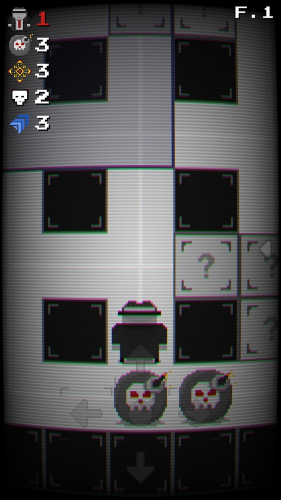
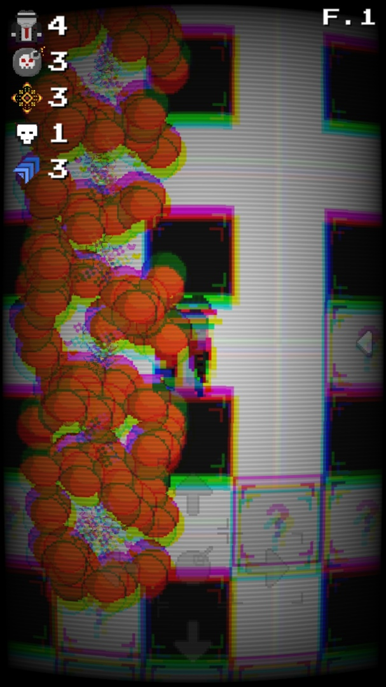
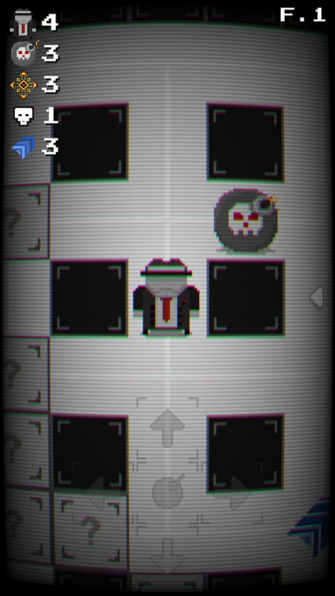
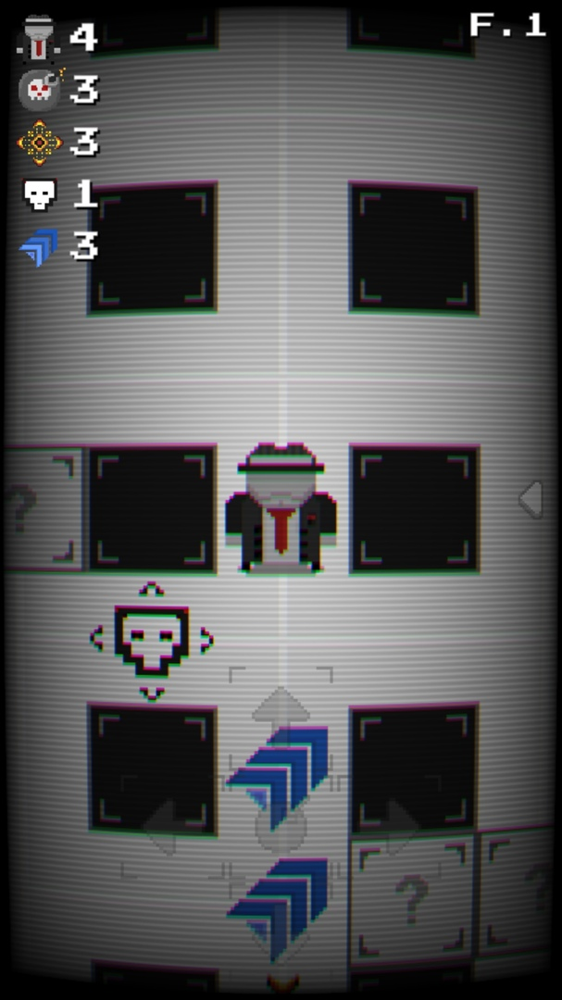
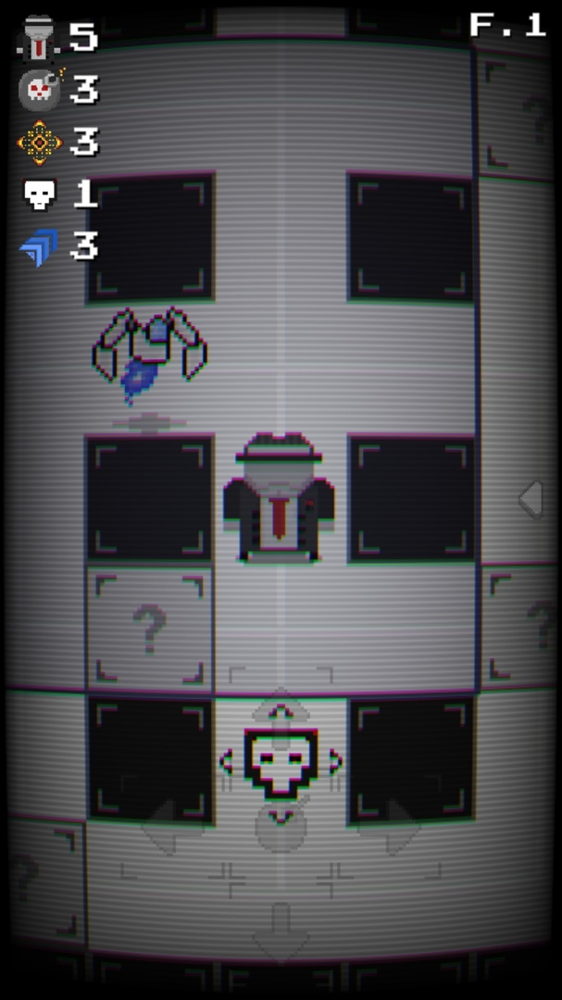
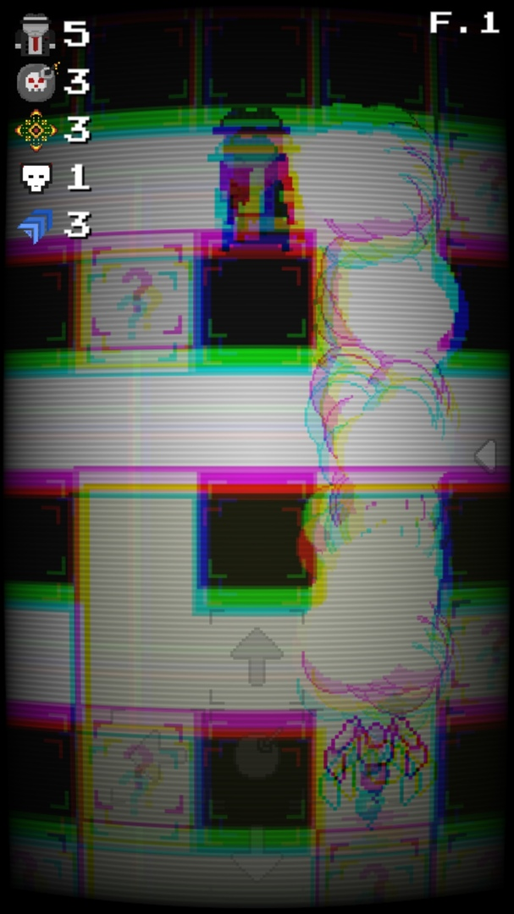

# The Bomber Man

`The Bomber Man is a remake of the cult game called Bomberman made on the Unity3D engine`

<table>
  <tr>
    <td></td>
    <td></td>
    <td></td>
  </tr>
  <tr>
    <td></td>
    <td></td>
    <td></td>
  </tr>
</table>

## Table of contents

- [Usage and installation](#usage-and-installation)
  - [Building](#building)
  - [Downloading](#downloading)
- [License](#license)

## Usage and installation

### Building

1. Download [Unity3D 2019.1.9f1](https://unity3d.com/ru/unity/whats-new/2019.1.9) with Android Build Support
2. Then build the game through the Unity editor.

### Downloading

You can also just download any version of the game from the [releases page](https://github.com/8teamCollab/the-bomber-man/releases) and then install it on your device.

## License

[The Bomber Man](https://github.com/8teamCollab/the-bomber-man) specific code is distributed under [GNU General Public License v3.0](https://github.com/8teamCollab/the-bomber-man/blob/master/LICENSE).

Copyright (c) 2020 8team
